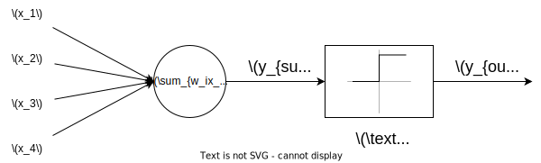
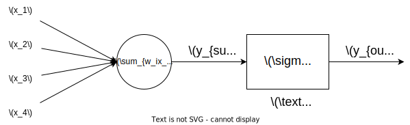
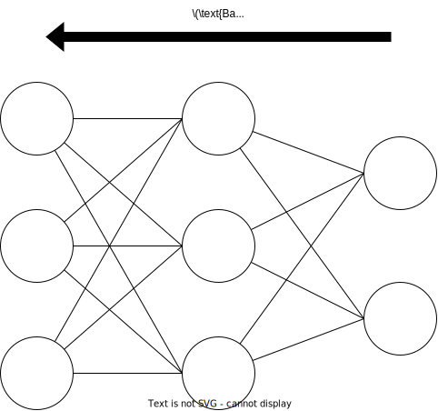
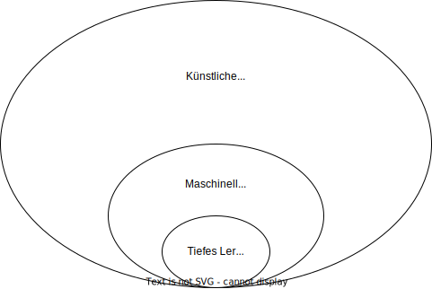
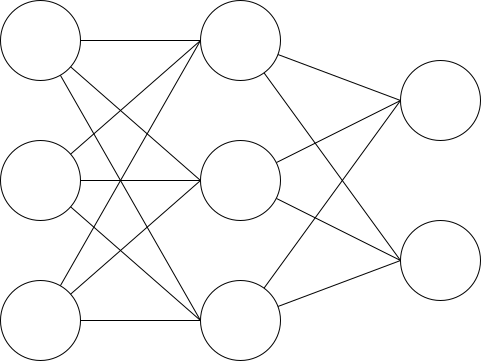
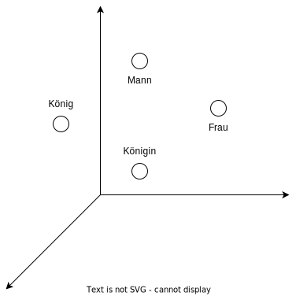
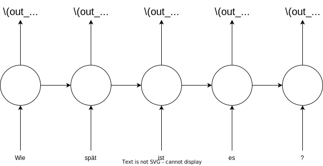
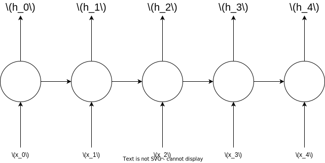
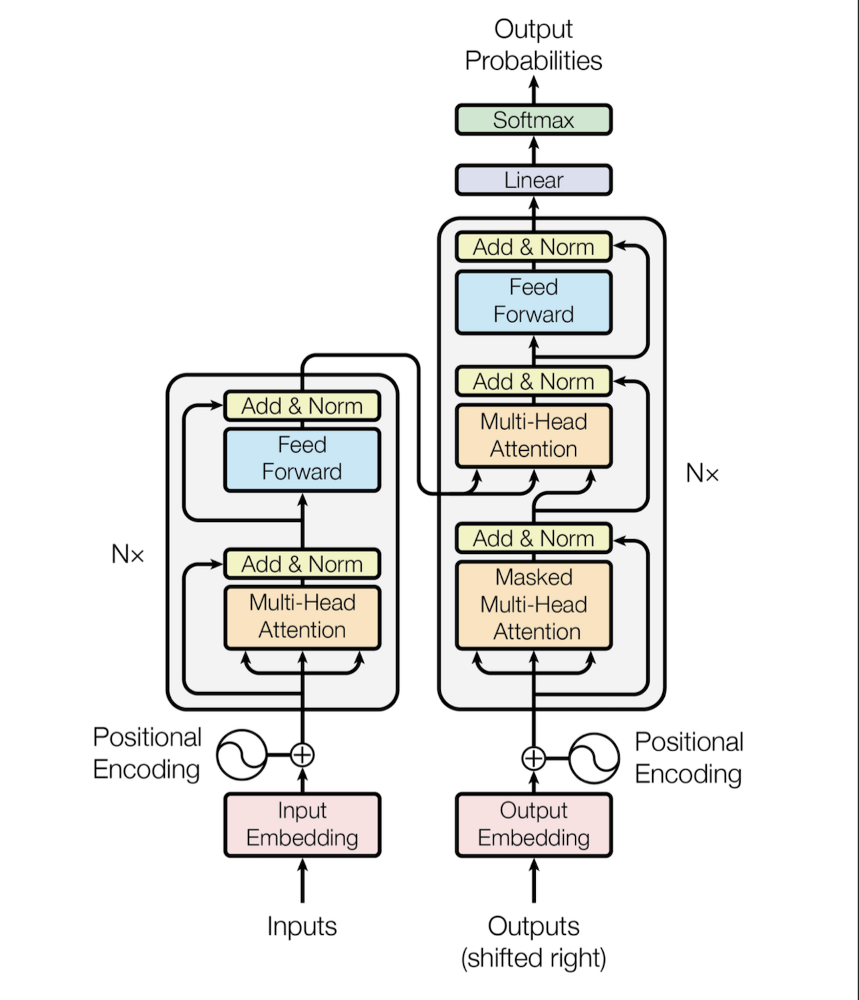

### Grundlagen

Die Arbeit basiert vor allem auf Transformer Modelle. Für das erstellen von Transformer Modelle bedarf es wissen verschiedener Grundlagen. Folgend werden Grundlagen Technologien beschrieben. 

### Neuronale Netze

Neurale Netzwerke sind Algorithmen die dafür entwickelt wurden die Funktionen eines Gehirns nachzubilden. 
Der erste Algorithmus der dazu entwickelt wurde ist das McCulloch-Pitts Neuronen Model [todo referenz]. 

 [todo bildunterschrift]

Dabei handelt es sich um folgende Funktion:

$$y = 1 \text{ wenn } w_1 \cdot x_1 + w_2 \cdot x_2 + \dots + w_n \cdot x_n \ge \theta$$
$$y = 0 \text{ sonst }$$

$y=$ Ausgabe des Neurons

$x_n=$ Eingabe des Neurons

$w_n=$ Gewichte des Neurons

$\theta=$ Schwellenwert

Der nächste Schritt in der Historie neuronaler Netzwerke war die Entwicklung des Perceptrons [todo referenz]. 

 [todo bildunterschrift]

Der Aufbau ist ähnlich zu dem des MP Neuronen Model unterscheidet sich aber darin, dass der Schellenwert kontinuierlich ist. Das heißt ein nach der Eingabe von Eingabe Werten kann die Ausgabe zum Beispiel 0.7 annehmen wohin bei einem linearen Schwellenwert das Ergebnis entweder 1 oder 0 sein kann. Anstatt nur die Schwellenwert Funktion kann das Perzeptron auch andere Aktivierungs funktionen annehmen [todo referenz zu bild].

Folgend eine Tabelle, welche beispielhafte Unterschiede aufzeigt:

| Beschreibung | MP Neuron | Perzeptron |
|---------|---------------------|----------------------|
| Typ des Modells | Binär | Linear |
| Schwellenwert | Statisch | Anpassbar während des Trainings |
| Ausgabe | Binär (1 oder 0) | Kontinuierliche Werte |

[todo multi layer perzeptron???]

### Backpropagation

Backpropagation ist eine Methode welche in künstlichen Neuronalen netzwerken benutzt wird um die Gewichte von einem neuronalen Netzwerk anzupassen um vorhersagen basierend auf einem Datenset liefern zu können. Der Algorithmus betrachtet zuerst die Gewichte an der Ausgabeschicht und geht von dort aus bis hin zur Eingabeschicht. 

 [todo bildunterschrift]

Angenommen man hat zwei Neuronen $x_1$ und $x_2$ in der Eingabeschicht, zwei Neuronen $h_1$ und $h_2$ in der versteckten Schicht, $y$ als Ausgangsneuron und die Gewichte $w1, w2, w3, w4, w5 \text{ und } w6$ zwischen den Neuronen.

Dabei berechnet man die Ausgabe $\hat{y}$ folgendermaßen:

$\hat{y} = f(w1 * x1 + w2 * x2 + w3 * h1 + w4 * h2)$

$f$ ist die Aktivierungsfunktion.

Um die Werte der einzelnen Gewichte so anzupassen genauere Ergebnisse zu erhalten verwendet man Backpropagation. Bei einem Durchlauf kommt es zu dem Ergebnis $\hat{y}$. Das ist die tatsächliche Ausgabe eines neuronalen Netzwerkes nach einem Durchlauf der Daten. Die tatsächliche Ausgabe wird mit dem Wert der erwarteten Ausgabe verglichen. Man berechnet den Fehler $\delta$ dieser zwei Werte. 

$\delta = (y - \hat{y})^2$ 

Für den Fehler ist es möglich verschiedene mathematische Funktionen zu benutzen. Eine übliche Funktion ist die der mittleren quadratischen Abweichung.

$MSE = \frac{1}{n} \sum_{i=1}^{n} (y_i - \hat{y_i})^2$

Die Funktion quadriert jedes einzelne Fehlersignal und summt am Ende alles zusammen und teilt es durch die Anzahl der Datenpunkte. Das Ergebnis ist der durchschnittliche Fehler aller quadrierten Datenpunkte. Es wird quadriert, weil die Ergebnisse sich dadurch leichter weiterverarbeiten lassen.

Nachdem das Fehler signal berechnet wurde besteht der nächste Schritt darin diesen Fehler rückwärts durch das Netzwerk zurück zu propagieren, um damit die Gewichte $w1, w2, w3, w4, w5 \text{ und } w6$ zu erneuern. 

Zuerst berechnet man den Gradient $\nabla$ von der Verlustfunktion mit respekt zu jedem einzelnen Gewicht im Netzwerk. Das passiert mit der Kettenregel von der Infinitesimalrechnung. Diese macht es möglich die Ableitung von der Verlustfunktion mit Respekt zu dem Gewicht zu berechnen.

Mit der Verlustfunktion $MSE$ würde der Gradient für das erste Gewicht wiefolgt definiert werden:

$\frac{\partial MSE}{\partial w1} = \frac{2}{n} \sum_{i=1}^{n} (y_i - \hat{y_i}) \cdot \frac{\partial \hat{y_i}}{\partial w1}$

$\frac{\partial \hat{y_i}}{\partial w1} = \frac{\partial f(w1 * x1 + w2 * x2 + w3 * h1 + w4 * h2)}{\partial w1}$

$\frac{\partial f(w1 * x1 + w2 * x2 + w3 * h1 + w4 * h2)}{\partial w1} = x_1 \cdot \frac{\partial f}{\partial w1}$

$\frac{\partial MSE}{\partial w1} = \frac{2}{n} \sum_{i=1}^{n} (y_i - \hat{y_i}) \cdot x_1 \cdot \frac{\partial f}{\partial w1}$

Dieser Gradient wird nun für jedes Gewicht berechnet. Eine Formel, die die Gewichte erneuert nennt man optimierer. Es gibt verschiedene Optimierer. Der folgende ist der stochastische Gradientenabstieg (SGD). Der SGD angewandt auf das erste Gewicht sieht so aus:

$w1' = w1 - \alpha \cdot \frac{\partial MSE}{\partial w1}$

dabei ist $\alpha$ die Lernrate. Die Lernrate ist ein Hyperparameter der die Schrittweite bestimmt in welcher Größe Gewichte erneurte werden. Bei einem kleineren $\alpha$ sind die erneuerungen kleiner, aber genauer und bei einem größeren $\alpha$ Wert sind die erneuerungen größer aber ungenauer. Hyperparameter nennt man die Parameter die vor einem Training eingestellt werden und nicht lernbar sind.

Der SGD Optimierer wird für jedes Gewicht angewandt. 

$w2' = w2 - \alpha \cdot \frac{\partial MSE}{\partial w2}$

$w3' = w3 - \alpha \cdot \frac{\partial MSE}{\partial w3}$

$w4' = w4 - \alpha \cdot \frac{\partial MSE}{\partial w4}$

$w5' = w5 - \alpha \cdot \frac{\partial MSE}{\partial w5}$

$w6' = w6 - \alpha \cdot \frac{\partial MSE}{\partial w6}$

Sobald jedes Gewicht neu berechnet wurde hat das Netzwerk eine Epoche des Trainings vervollständigt. Dieser Prozess wird dann in weiteren Epochen wiederholt bis die Leistung des Netzwerkes zufriedenstellend ist.

### Tiefes Lernen

Tiefes Lernen ist die weiterentwicklung der vorherig beschriebenen einfachen neuralen netzwerken und ein Teilbereich des maschinellen lernens. 

 [todo bildunterschrift]

Tiefes Lernen wurde durch die 2010er bekannt. Zu dieser Zeit kam es zur Verfügbarkeit von großen Datensets und Fortschritte in der Rechenleistung. In 2012 ein Model des Tiefen Lernen, welches von Google entwickelt wurde [todo referenz] erzielte einen Durchbruch in Bilderkennung und übertraf alle vorherigen Modelle auf dem ImageNet Datenset. Diese Leistung förderte ein breiteres Feld an Interesse für Tiefes Lernen und sorgte für Fortschritt in verschiedensten Bereichen von Anwendungen. Tiefes Lernen Algorithmen können unter anderem für Bild und Spracherkennung, NLP und das spielen von Spielen wie Schach und Go benutzt werden.

Es gibt verschiedene Architekturen, die für verschiedene Arten des lernens von Daten eingsetzt werden. Beispiele für Architekturen neuronaler Netzwerke sind auf folgender Grafik gut einsehbar:

 [todo referenz und bildunterschrift https://www.asimovinstitute.org/neural-network-zoo/]

Anstatt von einer Schicht, welche die Eingabewerte von Neuronen verarbeitet gibt es bei einem Deep Learning Modell mehrere Schichten. Die genaue Anzahl an Layern, die benötigt werden um ein Modell ein Deep Learning werden zu lassen ist nicht definiert. Der Begriff Deep Learning ist also ein eher allgemeiner Begriff der Modelle beschreibt die mehrere Schichten enthalten. Eine Schicht besteht jeweils aus Eingabewerten, einer Funktion welche die Eingabewerte verarbeitet und Ausgabewerte erzeugt. 

 [todo bildunterschrift]

### NLP

Natural language processsing (NLP) ist ein Teilbereich der Linguistik und des maschinellen lernens. Das verarbeiten von menschlicher Sprache findet eine breite Anwendung in verschiedensten Bereichen. Beispiele sind Eigennamen Erkennung, Maschinenübersetzung, Spracherkennung, Sentiment Analyse. Dadurch die sinnvolle weiterverarbeitung von Sprache eine komplexe Aufgabe ist, weil Wörter in verschiedene Kontexten zum Beispiel unterschiedliche Deutung besitzen können muss ein Tiefes Lernen Modell mit viel Daten trainiert werden um den verschiedenen Kontext zu erkennen.

Beispiel für unterschiedliche Wortbedeutung in unterschiedlichen Zusammenhängen:

Neben der Kirche befindet sich eine Bank.

Sprache muss zuerst auf ein für den Computer verständliches Medium reduziert werden, um damit Algorithmen entwickeln zu können. 

#### Tokenisierung

Tokenisierung ist ein wichtiger Schritt im NLP und ist oft der erste Schritt in einer NLP pipeline. Es wird benutzt um Text in kleinere Einheiten aufzuteilen, um somit das analysieren und weiterverarbeiten des Textes zu vereinfachen. Mit den kleineren Einheiten wird es einfacher Muster zu erkennen, Bedeutung zu extrahieren oder andere Operationen, die man auf dem Text ausführen möchte.

Es gibt verschiedene Arten der Tokenisierung. Zum Beispiel gibt es Wort Tokenisierung, Satz Tokenisierung und das Tokenisierung von einzelnen Satzzeichen. Welche der Beispiele sich am besten eignet hängt von der jeweiligen Aufgabe ab. Wort Tokenisierung eignet sich zum Beispiel für Aufgaben wie Textklassifizierung oder Übersetzung. Satzzeichen Tokenisierung könnte für das erkennen von handgeschriebener Schrift besser sein.

Beispiele für "Der Hund bellt.":

Tokenisiert mit Wort Tokenisierung --> "Der", "Hund", "bellt."

Satz Tokenisierung --> "Der Hund bellt."

Satzzeichen tokenisierung --> "D", "e", "r", " ", "H", "u", "n", "d", " ", "b", "e", "l", "l", "t", "."

#### Vektorisierung

Vektorisierung beschreibt den Prozess Text in numerische Vektoren umzuwandeln. Diese Umwandlung kann dann als Input für Algorithmen des maschinellen Lernens benutzt werden. Es gibt verschiedene Wege für das vektorisieren von Daten und hängt davon ab in welchem Kontext man Vektorisierung benutzen möchte. 

One-Hot-Codierung ist eine Methode in der jedes Wort mit einem binären Vektor dargestellt wird. Mit einer "1", wenn die Position dem Wort entspricht und sonst "0". Diese Methode kann großes Vokabular entstehen lassen. Ein Vokabular ist die Anzahl der einzigartigen Worte in einem Text. 

Beispiel für "Der Hund bellt.":

"Der" --> [1, 0, 0]

"Hund" --> [0, 1, 0]

"bellt." --> [0, 0, 1]

Worteinbettungen werden auf vielen Textdaten trainiert und die Vektoren für jedes Wort werden so gelernt, dass der Vektor den Kontext wiederspiegelt in welchem das Wort auftritt. Wörter die in einem ähnlichen Kontext auftreten tendieren dazu ähnliche Vektoren zu haben. Wörter mit unterschiedlichen Kontexten dagegen haben unterschiedlichere Vektoren. 

 [todo bildunterschrift]

### NER

Named entity recognition (NER) ist eine NLP Aufgabe mit der man Eigennamen in einem Text, wie Personen, Organisationen und Orte identifizieren kann. Das macht NER nützlich für Applikationen wie das beantworten von Fragen, Informationsextrahierung und Dokument Zusammenfassungen.

 [todo bildunterschrift]

Es gibt verschiedene Ansätze für die Durchführung von NER. Es gibt Regelbasierte Systeme, Systeme basierend auf maschinellem Lernen und Hybrid Systeme. Regelbasierte Systeme benutzen definierte Regeln für das identifizieren von Eigennamen in Text. Systeme basierend auf maschinellem Lernen das identifizieren von Eigennamen anhand von gelabelten Trainingsdaten. Hybride Systeme kombinieren beide Vorgehensweisen.

Um NER durchzuführen tokenisiert man den Text zuerst zu individuellen Wörtern und dann benutzt man Techniken wie Wortarten-Tagging oder Abhängigkeitsanalyse. Die Ausgabe von NER ist eine Liste mit Eigennamen und den dazugehörigen Attributen.

**Wortarten-Tagging**

Mit Wortarten-Tagging identifiziert man die grammatische Rolle eines Wortes in einem Satz. Die Labels geben die Wortart an wie Verb, Adjektiv und Subjektiv.

Mit dem Satz "Der Hund bellte in Venedig." ergibt das Wortarten-Tagging folgende Ausgabe:

"Der" (ART) für Artikel
"Hund" (SUB) für Substantiv 
"bellte" (VER) für Verb 
"in" (PRÄ) für Präposition
"Venedig" (SUB) für Substantiv

Mit den Wortart Tags kann man "Hund" und "Venedig" als Eigennamen identifizieren. Die Methode ist hilfreich für NER, weil Eigennamen oft auch Substantive sind und daher kann man mit Wortarten-Tagging helfen Eigennamen genauer zu identifizieren.

**Abhängigkeitsanalyse**

Bei der Abhängigkeitsanalyse analysiert man die grammatikalische Struktur von einem Satz und bestimmt seine Abhängigkeiten zwischen seinen Worten. Zusammen mit NER kann es helfen besser Eigennamen in einem Text zu erkennen.

Jedes Wort von einem Satz wird als Knoten in einer Baumstruktur repräsentiert. Die Baumstruktur nennt man Abhängigkeitsanalysebaum. Die Abhängigkeiten zwischen den Wörtern sind repräsentiert als Kanten welche die Knoten verbinden. Die Wurzel des Baumes stellt das Hauptverb da. Die anderen Knoten sind unter andere Verben, Adjektive und Substantive.

Mit dem Satz "Der Hund bellte in Venedig." ergibt die Abhängigkeitsanalyse folgende Ausgabe:

         bellte
        /    \
       /      \
      Hund     in 
     /          \
    /            \
    Der          Venedig
   

Dabei ist "bellte" das Hauptverb, "Der Hund" das Subjekt und "in Venedig" das Adverb. Beim analysieren von den Abhängigkeiten kann man "Hund" und "Venedig" als Eigennamen identifizieren.

Es gibt verschiedene Bibliotheken, welche man für NER benutzen kann - Stanford NER, spaCy, NLTK und HuggingFace [todo links].  

### Labeling

Labeling wird der Prozess genannt bei dem man einem Datenpunkt einer Klasse zuordnet. Labels sind da um einen Datenpunkt mit einer eindeutigen Klasse zu verweisen. Zum Beispiel sind beim erkennen von Eigennamen zu jedem Wort ein Label dazugehörig, welches eine Aussage über das Attribut, um welches es sich handelt macht. Labels werden benutzt um eine Model des maschinellen Lernens zu trainieren, um dann Vorhersagen über neue, nicht vorher gesehenen Daten treffen zu können.

Es gibt verschieden Möglichkeiten Daten zu labeln. Man kann Menschen manuell labeln lassen. ImageNet ist ein Beispiel für ein Datenset was zum Teil von Menschen gelabelt wurde [todo referenz]. Der Vorteil ist, dass man eine hohe Qualität erwarten kann, aber im Vergleich zu anderen Techniken sehr zeitintensiv sein kann.

Eine andere Methode ist die des automatischen labeling. Beispiele sind Regel basierte Systeme oder aktiv lernende Algorithmen. Die Vorteile dabei sind, dass das labeln schneller geht aber dafür nicht so genau ist.

**Regel basierte Systeme**

Zuerst muss man sich manuell ein Datenset mit Labeln erzeugen. Zum Beispiel würde "Angela Merkel wurde 1954 in Hamburg geboren." die gelabelten Eigennamen "Angela Merkel" und "Hamburg" enthalten. 
Danach trainiert man das Datenset mit einem überwachten Algorithmus für maschinelles Lernen. Das Ziel des Models dabei ist die Muster der Entitäten im Text zu erkennen.  
Das Model kann als eine Funktion $f$ dargestellt werden, welche eine Eingabe $x$ (ein Text Dokument) nimmt und eine Ausgabe $y$ (die Labels für die bestimmten Eigennamen) erzeugt. Die Funktion $f$ lernt mit einem Trainingsalgorithmus von dem gelabelten Datenset. 
Wenn das Model trainiert ist kann es für das bestimmen von neuen Labels bei eingebenen Text Dokumenten mit Eigennamen bestimmen. Zum Beispiel sollte das Model bei der Eingabe von "Wolfgang Schäuble wurde 1942 in Freiburg geboren." die Eigennamen "Wolfang Schäuble" und "Freiburg" vorhersagen.
Die erstellten Labels werden benutzt um neue Regeln zu erzeugen oder bestehende zu erweitern. 

**Aktiv lernende Algorithmen**

Gestarted wird mit einem überwachten Algorithmus für maschinelles Lernen, um von einem kleinen gelabelten Datenset zu lernen. Dann benutzt man das trainierte Model um vorhersagen für ungelabelte Daten zu treffen. Als nächstes werden die Beispiele genommen bei denen das Model die größte Unsicherheit besitzt bei der Vorhersage. Das sind zum Beispiel Eigennamen die im Model nicht vorkommen. Die gewählten Beispiele werden menschlich gelabelt und zu dem gelabelten Datenset hinzugefügt. Nach diesem Schritt wird das Model neu trainiert. Diesen Schritt wiederholt so oft bis die gewünschte Leistung erreicht ist. Es ist auch möglich die Labels zufällig zu wählen, anstatt die Labels zu wählen, bei denen das Model die größte Unsicherheit besitzt. Der Nachteil beim zufälligen wählen ist, dass das Model länger braucht bessere Leistung zu erzielen.

Für alle Ansätze giilt, dass eine gute Qualität der Labels signifikant ist, um schlechte Trainingsergebnisse vermeiden zu können und eine Algorithmus effektiv lernen lassen zu können.

### RNN 

Ein Rekurrentes neuronales Netzwerk (RNN) ist ein Typ von neuronales Netzwerk welches entwurfen wurde um nacheinander ablaufende Daten zu verarbeiten. 

In RNN's wird jeder Zeitpunkt in der Eingabe vom Netzwerk verarbeitet. Bei der Eingabe von einem Satz wie "Wie spät ist es?" ist jedes einzelne Wort gleich einem Zeitpunkt. Die Ausgabe an jedem Zeitpunkt ist Abhängig von der Ausgabe vom vorherigen Zeitschritt. Das erlaubt dem Netzwerk Abhängigkeiten, welche sich über mehrer Zeitschritte erstrecken zu erkennen. 

Angenommen man hat ein Model für Übersetzung. Wenn das RNN den Satz "Wie spät ist es?" für eine Übersetzung bearbeiten soll muss man den Satz erst in ein sequentielles Datenformat bringen, also zum Beispiel "Wie", "spät", "ist", "es", "?". Dann wird dem RNN zuerst "Wie" als Eingabe übergeben, als nächstes "spät" mit der vorherigen Eingabe, also "Wie" und so weiter bis die Sequenz beendet ist. Die Repräsentation die dadurch entsteht kann dann beispielsweise in einen Feed-Forward-Netzwerk weiter verarbeitet werden [todo referenz auf https://commons.wikimedia.org/wiki/Artificial_neural_network#/media/File:RecurrentLayerNeuralNetwork_english.png um RNN in einem feed forward netzwerk zu demonstrieren?]. 

 [todo bildunterschrift]

Mathmatisch kann ein RNN wiefolgt beschrieben werden:

$h(t) = f(h(t-1), x(t))$

Dabei ist $h(t)$ die Ausgabe an jedem Zeitpunkt $t$, $h(t-1)$ is die Ausgabe am vorherigen Zeitpunkt und $x(t)$ ist die Eingabe am Zeitpunkt $t$. Die Funktion $f$ repräsentiert das innere eines RNN. 

 [todo bildunterschrift]

### LSTM

Long Short-Term Memory (LSTM) Netzwerke sind entwickelt worden um das Problem der verschwindenden Gradienten zu lösen, welches bei der Trainierung von traditionellen rekurrenten neuronalen Netzen (RNNs) auftreten kann. 

In traditionellen RNNs sind die verborgenen Zustände zu jedem Zeitpunkt erneuert, indem der vorherige verborgene Zustand und die gegenwärtige Eingabe benutzt wird. 

Bei dieser Regel kann es zu Problemen kommen beim lernen von langfristigen Abhängigkeiten, weil der Gradient des Fehlers mit Respekt zum verborgenen Zustand und den Gewichten dazu tendieren zu verschwinden mit fortschreitenden Zeitpunkten. Das ist als das Problem der verschwindenden Gradienten bekannt.

LSTMs sind entwickelt wurden das Problem zu lösen. Dabei wurden weitere Netzwerk Strukturen eingeführt, welche "Gedächtniszellen" und "Tore" genannt werden. Die Tore können von den Gedächtniszellen länger Informationen speichern und abrufen. 

Damit sind LSTMs in der Lage langfristige Abhängigkeiten in den Daten zu behalten und die Leistung von RNNs zu übersteigen.

An jedem Zeitpunkt $t$, bekommt das LSTM als Eingabe die gegenwärtige Eingabe $x_t$ und den vorherigen verborgenen Zustand $h_{t-1}$ und erzeugt einen neuen verborgenen Zustand $h_t$ und eine Ausgabe $y_t$.

Der verborgene Zustand $h_t$ ist eine Funktion von der gegenwärtigen Eingabe $x_t$ dem vorherigen verborgenen Zustand $h_{t-1}$ und den vorherigen Zell Zustand $c_{t-1}$. Der Zellenzustand $c_t$ ist eine "Erinnerung" an vergangene Eingaben und verborgene Zustände, die über die Zeit aufrechterhalten wird.

[todo grafik und beispiel hinzufügen]

### Transformer

Die Transformer Architektur wurde in dem Paper [todo "Attention is All You Need" by Vaswani et al. in 2017] vorgestellt. Die Architektur schlägt die die Leistung von vorher existierenden Modellen wie LSTMs und RNNs, die versuchen sequentielle Daten zu modellieren. 

 [todo bildunterschrift]

Die Hauptinnovation bei Transformern ist die Benutzung von Selbstaufmerksamkeitsmechanismen. Damit kann das Model die Eingabedaten an jeder Stelle dynamisch bewerten und den Kontext den Kontext von aneren Positionen verwenden, beim durchführen von vorhersagen. Zu traditionellen Modellen underscheidet sich das dadurch, das keine Fenster mit fester Länge oder wiederkehrende Verbindungen verwendet werden, um den Kontext zu erfassen.

Die Transformer Architektur besitzt folgende Hauptkomponenten:

Selbstaufmerksamkeitsschichten, die es dem Modell ermöglichen, die Eingabedaten an jeder Position dynamisch zu gewichten und den Kontext von anderen Positionen zu nutzen, wenn Vorhersagen getroffen werden.

Positionsbezogene Feed-Forward-Schichten, welche die Eingabedaten an jeder Position unabhängig verarbeiten und das erkennen von komplexeren Mustern ermöglichen.

Ein Encoder, der die Sequenz der Eingabedaten nimmt und eine kontinuierliche Darstellung der Eingabe erzeugt.

Ein Decoder, der die Kontinuierliche Darstellung aufnimmt und eine Ausgabesequenz erzeugt.

Der Decoder und Encoder bestehen dabei aus mehreren Positionsbezogenen Feed-Forward-Schichten und Selbstaufmerksamkeitsschichten. 

[todo add architecture diagramm from paper]

Folgend die mathematische Definition für Selbstaufmerksamkeitsschichten und Positionsbezogene Feed-Forward-Schichten:

**Selbstaufmerksamkeitsschichten:**

Wenn $X$ die Eingabe Daten sind, mit $X \in \mathbb{R}^{n \times d}$ wo $n$ die Länge der Sequenz und $d$ Dimension der Eingabedaten ist.

Seien $Q$, $K$ und $V$ Matrizen, die verwendet werden, um die Eingabedaten in verschiedene Räume zu projizieren, mit $Q \in \mathbb{R}^{n \times d_k}$, $K \in \mathbb{R}^{n \times d_k}$, und $V \in \mathbb{R}^{n \times d_v}$. Die Werte $d_k$ und $d_v$ sind die Dimensionen von den projizierten Räumen.

Die Selbstaufmerksamkeitsschichten berechnen die Aufmerksamkeitsgewichte für jede Position, indem sie das Skalarprodukt der projizierten Eingabedaten nimmt und durch die Quadratwurzel der projizierten Raumdimensionen dividiert:

$$ Attention(Q, K, V) = softmax(\frac{QK^T}{\sqrt{d_k}})V $$

Die Ausgabe der Selbstaufmerksamkeitsschicht ist dann die gewichtete Summe der Eingabedaten, wobei die Gewichte durch die Aufmerksamkeitsgewichte gegeben sind:

$$ Output = Attention(Q, K, V) $$

In dieser Gleichung ist das Skalarprodukt von $Q$ und $K^T$ ein Maß für die Ähnlichkeit zwischen den Eingabedaten an jeder Position, und die Division durch die Quadratwurzel von $d_k$ wird verwendet, um das Skalarprodukt zu skalieren. Die Aufmerksamkeitsgewichte werden dann mit der Softmax-Funktion berechnet, die die Skalarproduktwerte so normalisiert, dass sie sich zu 1 summieren. Die endgültige Ausgabe ist die gewichtete Summe der Eingabedaten, wobei die Gewichte durch die Aufmerksamkeitsgewichte gegeben sind.

**Positionsbezogene Feed-Forward-Schichten:**

Seien $x$ die Eingabedaten an einer gegebenen Position, mit den Dimensionen der Eingabedaten $x \in \mathbb{R}^{d}$ und $d$.

Die Positionsbezogene Feed-Forward-Schicht wendet eine lineare Transformation auf die Eingabedaten an, gefolgt von einer nichtlinearen Aktivierungsfunktion:

$$ y = activation(W_1x + b_1) $$

Die Ausgabe der positionsweisen Feed-Forward-Schicht wird dann durch eine zweite vollständig verbundene Schicht geleitet, die eine weitere lineare Transformation anwendet:

$$ z = W_2y + b_2 $$

$W_1$, $W_2$, $b_1$, und $b_2$ sind die Gewichte und Biase der zwei vollständig verbundenen Schichten.

[todo grafiken hinzufügen und mit Beispiel verbinden]

### Seq2seq

Die seq2seq Architektur besteht aus zwei Hauptkomponenten, den Encoder und einen Decoder. 

Der Encoder bekommt als Eingabe zum Beispiel einen Satz. Dieser Satz wird in einen Kontext Vektor konvertiert, der immer die gleiche Länge besitzt, egal bei welcher länge Eingabedaten. Der Kontextvektor wird dann an den Decoder weitergeleitet, der dafür verantwortlich ist die Ausgabe zu erzeugen. 

[todo image of seq2seq]

Mathematisch kann das seq2seq Model wiefolgt zusammengefasst werden:

Der Encoder verarbeitet die Eingabedaten Element für Element. Bei einem seq2seq für Übersetzung, wenn die Eingabe "Der Hund bellte." ist, dann wird zuerst das Wort "Der" verarbeitet, dann "Hund" und so weiter. An jedem Zeitpunkt $t$ nimmt der Encoder eine Eingabe "x_t" und benutzt diese Eingaeb um den verborgenen Zustand "h_t" mit dieser Eingabe zu erweitern. Der verborgene Zustand $h_t$ ist die Zusammenfassung der gesamten Information die bisher verarbeitet wurde.

Mathematisch ist der verborgene Zustand so definiert:

$$h_t = f(h_{t-1}, x_t)$$

$f$ ist eine nicht lineare Aktivierungs Funktion wie die Sigmoid oder Tanh Funktion.

Wenn der Encoder die gesamte Eingabe verarbeitet hat. Also den ganzen Satz "Der Hund bellte.", erzeugt der Encoder einen finalen verborgenen Zustand $h_T$. $h_T$ wird als Kontext Vektor $c$ benutzt. Dieser Kontextvektor $c$ wird dann an den Decoder weitergegeben. Der Decoder benutzt den Kontextvektor um den Ausgabesatz "The dog barked." zu produzieren.

Das verarbeiten des Kontextvektor passiert wie beim Encoder mit den Eingabedaten Element für Element. Das heißt bei der Ausgabe "Der Hund bellte." erzeugt der Decoder zuerst "The". An jedem Zeitpunkt "t" nimmt der Decoder den vorherig verborgenen Zustand $h_{t-1}$ und die vorherige Ausgabe $y_{t-1}$ und benutzt diese um die gegenwärtige Ausgabe $y_t$ zu erzeugen. 

Mathematisch ist die Ausgabe an jedem Zeitpunkt berechnet wiefolgt:

$$y_t = g(h_{t-1}, y_{t-1})$$

$g$ ist eine nicht lineare Aktivierungs Funktion wie die Sigmoid oder Tanh Funktion.

Der Decoder erzeugt solange Ausgaben $y_t$ bis die engültige Zielausgabe "Der Hund bellte." erzeugt wurde. Das gesamte seq2seq Modell ist trainiert um den Unterschied zwischen der vorhergesagten Ausgabe und der gewünschten Ausgabe zu minimnieren. Dabei benutzt man einen Optimierungsalgorithmus wie den stochastischer Gradientenabstieg.

[todo Grafiken]
